# NetBeans Claude Code GUI — User Manual

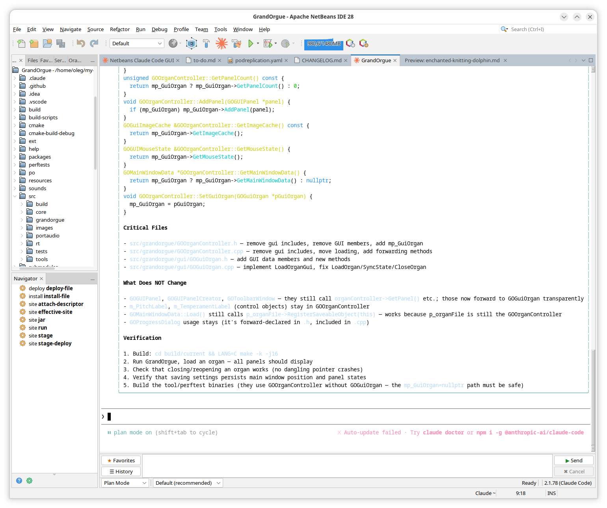

## Table of Contents

1. [Overview](#1-overview)
2. [Requirements & Installation](#2-requirements--installation)
3. [Quick Start](#3-quick-start)
4. [Session Window](#4-session-window)
5. [Sending Prompts](#5-sending-prompts)
6. [Favorites](#6-favorites)
7. [Prompt History](#7-prompt-history)
8. [File Attachments](#8-file-attachments)
9. [Interactive Prompts (Choice Menu)](#9-interactive-prompts-choice-menu)
10. [File-Change Permissions (Diff Panel)](#10-file-change-permissions-diff-panel)
11. [Settings (Tools → Options → Claude Code)](#11-settings)
12. [Profiles](#12-profiles)
13. [Managing Sessions](#13-managing-sessions)
14. [IDE Tools (MCP)](#14-ide-tools-mcp)
15. [Troubleshooting](#15-troubleshooting)


---

## 1. Overview

NetBeans Claude Code GUI is a NetBeans IDE plugin that embeds the Claude Code CLI as a full interactive terminal session directly inside the IDE. You type prompts in a dedicated session tab, Claude reads and edits your project files, and the plugin provides:

- a graphical file diff (using NetBeans' built-in diff viewer) before any change is written to disk
- a graphical panel for responding to Claude's interactive questions

IDE integration (open editors, diagnostics, current selection) is exposed to Claude via the MCP protocol so that Claude always has full context about your work.

---

## 2. Requirements & Installation

See [Installation & Build](installation.md) for requirements, installation steps, and build instructions.

---

## 3. Quick Start

1. Right-click your project in the **Projects** window → **Open with Claude Code**.
2. A session tab opens and Claude Code starts. Wait for the Claude Code prompt to appear in the terminal.
3. If this is the first time running Claude Code (or the first time for this project), answer Claude's initial setup questions in the terminal or the choice panel.
4. Type your first prompt in the input area at the bottom (e.g., `Explain what this project does`).
5. Press **Ctrl+Enter** (default) to send. Claude's response appears in the terminal.

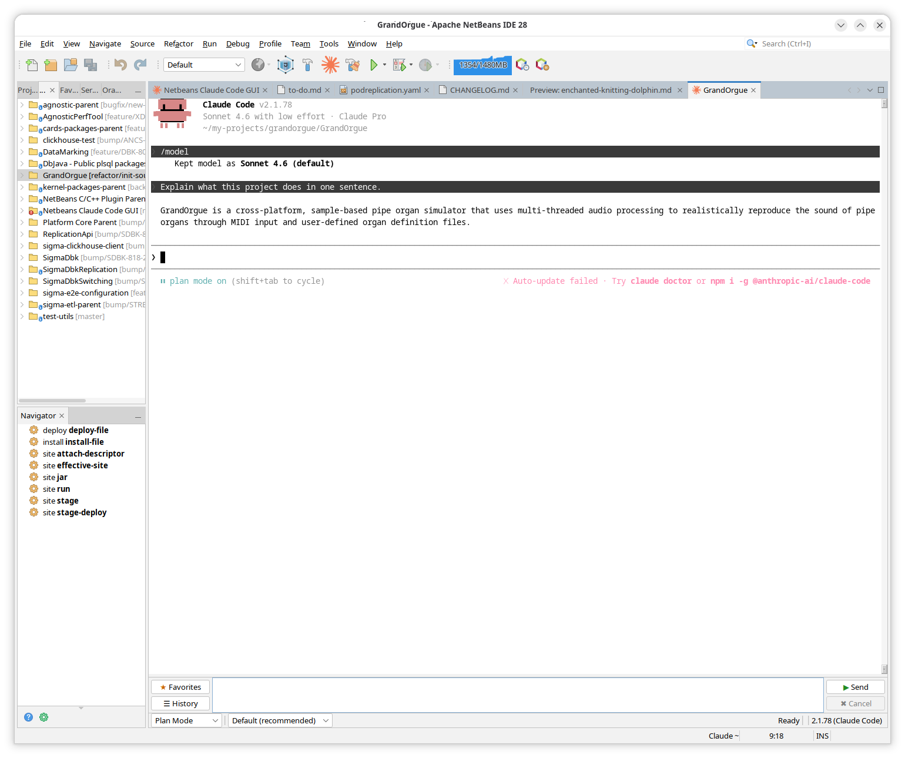

---

## 4. Session Window

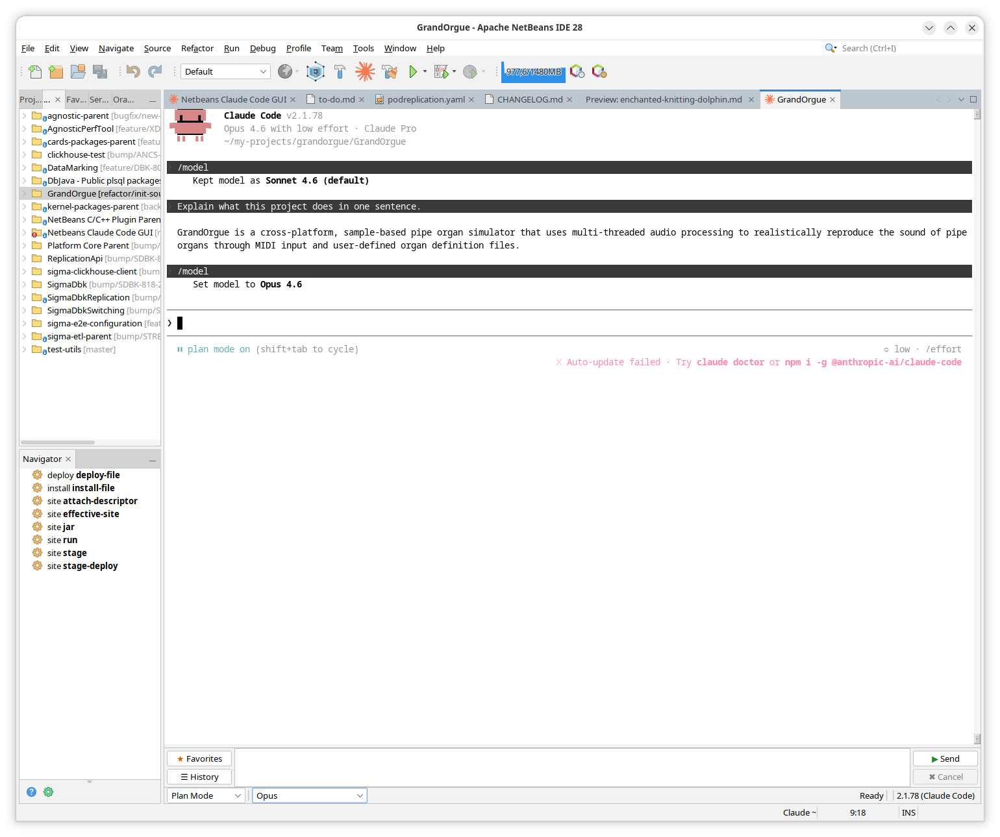

The session tab contains the following areas:

### Terminal area (center)
Displays Claude Code output. You can also click into the terminal and interact with Claude Code directly — as if it were running in a standalone terminal. Use this when the plugin fails to detect Claude's state correctly, for example if an interactive choice panel was not shown.

### Prompt panel (bottom)
Contains the input area, **▶ Send** / **✖ Cancel** buttons, and **☰ History** / **★ Favorites** buttons.

### Status bar (below the prompt panel, visible during an active session)

**Edit mode selector** — controls how Claude handles file edits:

| Label | Internal value | Description |
|-------|---------------|-------------|
| Plan Mode | `plan` | Claude can discuss and plan but cannot edit files |
| Ask on Edit | `default` | Claude asks for permission before each edit (default) |
| Accept on Edit | `acceptEdits` | Claude applies edits automatically without asking |

Press **Shift+Tab** anywhere in the prompt panel to cycle through modes.

**Model selector** — lists the models available in the current session. Standard entries (`sonnet`, `opus`, `haiku`) are discovered by opening the `/model` menu. For **Other API** profiles, any models assigned the `custom` alias in **Model Aliases** also appear here, shown by their full provider ID. Selecting a model switches to it immediately.

On the right side of the status bar:

- **Session state** — `Starting` while the process is initializing, `Ready` when Claude is waiting for input, `Working` while a task is in progress.
- **Active plan** — name of the current plan file, if any (shown when Claude is operating in plan mode with a saved plan).
- **Claude version** — the version of the `claude` CLI detected at session start.

---

## 5. Sending Prompts

### Input area
A multi-line text area. Wrap long prompts naturally — newlines are preserved. `@path` tokens are highlighted in blue (see [File Attachments](#8-file-attachments)).

### Sending
Press the configured **send key** (default: **Ctrl+Enter**) or click the **▶ Send** button. The input area is cleared after sending.

You can change the send key in **Tools → Options → Claude Code → General** (choices: Enter, Shift+Enter, Ctrl+Enter, Alt+Enter).

### Cancelling
Press **Escape** in the input area, or click the **✖ Cancel** button to interrupt Claude's running task.

### Edit mode
Press **Shift+Tab** anywhere in the prompt panel to cycle Claude Code's edit mode. The current mode is shown in the status bar.

### Button states
- **▶ Send** is active only when Claude is idle and ready to accept input.
- **✖ Cancel** is active only when Claude is working.

If the states appear out of sync:
- Send is inactive but Claude is ready — click **✖ Cancel** to reset the state.
- Cancel is inactive but Claude is working — click into the terminal area and interact directly.

### Context menu (right-click in the input area)

| Item | Description |
|------|-------------|
| Cut / Copy / Paste / Select All / Clear | Standard text editing actions |
| **Add to Favorites** | Saves the current input text as a project favorite (active only when the input is non-empty and a working directory is set) |
| **Favorites...** | Opens the Favorites dialog |
| **Start New Session** | Immediately closes the current session and opens a fresh one (available only during an active session) |
| **Switch to Session…** | Opens the Save & Switch dialog pre-selecting "Resume specific" (available only during an active session) |

---

## 6. Favorites

Favorites are saved prompts you can reuse with a button click or a keyboard shortcut.

### Scope
- **Global favorites** — available in every project. Managed in **Tools → Options → Claude Code → Favorites**.
- **Project favorites** — available only for a specific working directory.

### Adding a favorite
Right-click the input area → **Add to Favorites**. This always adds to **project** favorites. To promote a project favorite to global, use the **To Global** button in the Favorites dialog.

### Favorites dialog

Click **★ Favorites** in the prompt panel to open the dialog.

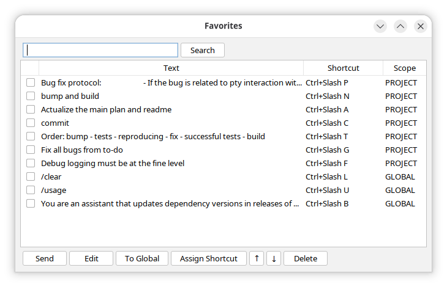

The dialog shows a table with the following columns:

| Column | Description |
|--------|-------------|
| ☐ | Checkbox for multi-select |
| **Text** | Prompt text (truncated to 100 characters) |
| **Shortcut** | Assigned keyboard shortcut, if any |
| **Scope** | `PROJECT` or `GLOBAL` |

**Buttons:**

| Button | Effect |
|--------|--------|
| **Send** | Loads the selected favorite into the input area and closes the dialog (also triggered by double-click) |
| **Edit** | Edit the text of the selected favorite |
| **To Global** | Move selected PROJECT favorite(s) to global scope |
| **Assign Shortcut** | Assign a keyboard shortcut to the selected favorite |
| **↑ / ↓** | Change the display order of favorites |
| **Delete** | Delete selected favorite(s) (PROJECT only — global favorites can only be deleted via **Tools → Options → Claude Code → Favorites**) |

The search field filters entries by text.

### Assigning keyboard shortcuts

Click **Assign Shortcut** to open the shortcut capture dialog. Press the desired key combination(s) — they are displayed in the field. Multiple key combos can be chained (e.g., `Ctrl+K Ctrl+F`).

If the combination is already used by another favorite, a conflict warning is shown and **OK** is disabled.

**Note:** All key presses are captured as shortcut input — to close the dialog use the **OK**, **Clear**, or **Cancel** buttons with the mouse.

Shortcut conflicts with other NetBeans IDE actions are not checked automatically. If a shortcut does not work, check for conflicts in **Tools → Keymap** (search "Claude Favorite").

---

## 7. Prompt History

The plugin records every sent prompt per working directory.

### In-session keyboard navigation

| Action | Key |
|--------|-----|
| Previous prompt (older) | Ctrl+Up |
| Next prompt (newer) | Ctrl+Down |

These keys work inside the input area. At the most-recent position, Ctrl+Down clears the field.

### History dialog

Click the **☰ History** button to open the History dialog.

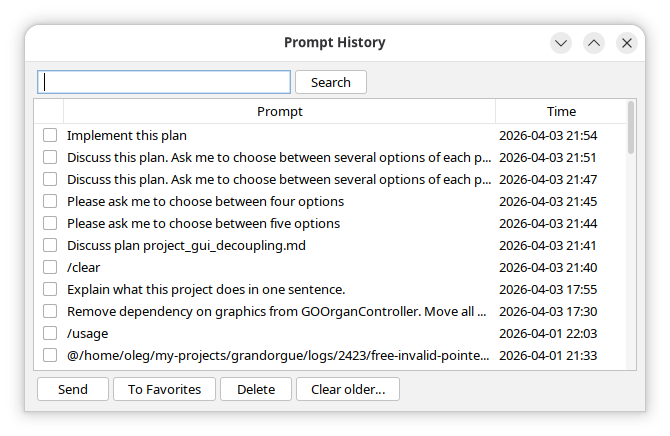

The dialog shows history for the current working directory. The table has the following columns:

| Column | Description |
|--------|-------------|
| ☐ | Checkbox for multi-select |
| **Prompt** | Prompt text (truncated to 120 characters) |
| **Time** | Date and time the prompt was sent (`yyyy-MM-dd HH:mm`) |

**Buttons:**

| Button | Effect |
|--------|--------|
| **Send** | Loads the selected entry into the input area and closes the dialog (also triggered by double-click) |
| **To Favorites** | Saves selected entries as project favorites |
| **Delete** | Deletes selected entries |
| **Clear older…** | Opens a date input dialog (`yyyy-MM-dd`); deletes all entries from that date and older (with confirmation) |

The search field filters entries by prompt text.

### History settings

Configure in **Tools → Options → Claude Code → General**:

| Setting | Default | Description |
|---------|---------|-------------|
| History max depth | 200 | Maximum entries kept per working directory |
| History TTL (days) | 0 (forever) | Entries older than this are purged automatically |

---

## 8. File Attachments

You can attach files to a prompt as `@path` tokens. Claude Code interprets these as file references.

### @-completion popup

Type `@` anywhere in the input area. A popup appears listing the contents of the current directory level. Hidden files (starting with `.`) are not shown. `..` is always present for navigating up.

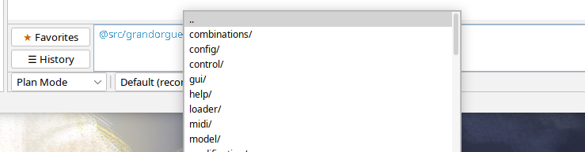

| Key | Action |
|-----|--------|
| Up / Down | Navigate the list |
| Enter or Tab | File: insert and close popup. Directory: navigate into it. |
| Space | Insert the current item as-is (even if it is a directory) and close the popup |
| Escape | Dismiss the popup |
| Double-click | Same as Enter |

### Drag-and-drop and paste

You can drag items from the OS file manager or the NetBeans **Projects** tree and drop them onto the input area, or paste them via **Ctrl+V**, **Shift+Ins**, or **Paste** from the context menu.

Three types of content are supported:

| Content type | What is inserted |
|-------------|-----------------|
| **File** inside the working directory (from OS or Projects tree) | Relative path without `@` (e.g. `src/Main.java`) |
| **File** outside the working directory | `@/absolute/path` |
| **Package directory** (under a source root such as `src/main/java/`) | Fully-qualified package name (e.g. `com.example.util`) |
| **Directory** inside the working directory (not a source root) | Relative path without `@` |
| **Directory** outside the working directory | `@/absolute/path` |
| **Image** from clipboard | Saved as a temporary PNG file; `@/tmp/....png` inserted |
| **Plain text** | Inserted as-is |

---

## 9. Interactive Prompts (Choice Menu)

Claude Code sometimes presents interactive prompts (Yes/No or multiple choice). The plugin detects these and shows a **Choice Menu** panel **in place of** the prompt input area.

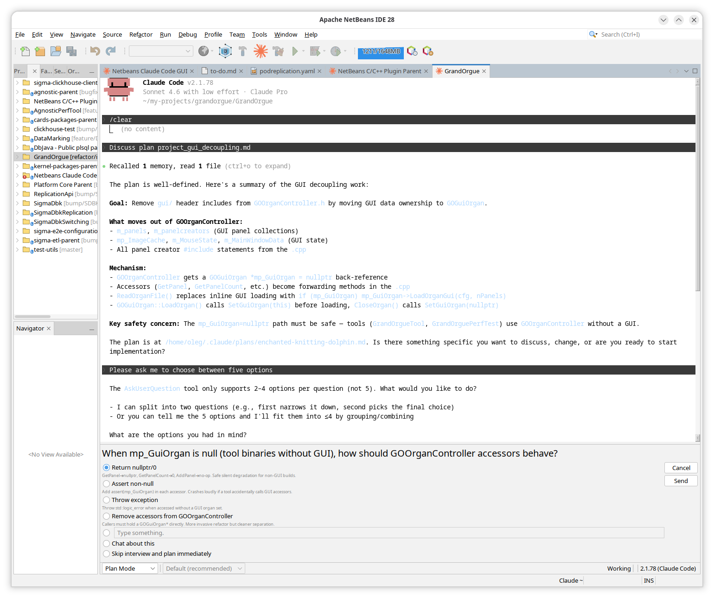

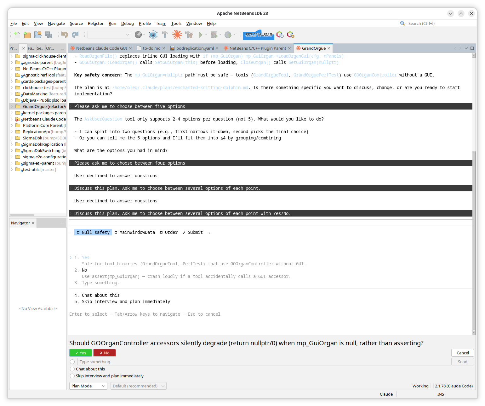

**Yes / No options** appear as buttons. Clicking one sends the answer immediately and closes the panel.

**Other options** appear as radio buttons. Some options may include a text field for additional input. Click the desired option (and optionally fill in the text field), then press **Enter** or click **Send** to submit. Press **Escape** to cancel.

After submitting or cancelling, the input area is restored automatically.

**Note:** If the choice panel does not appear when Claude asks a question, or appears unexpectedly without a question — click into the terminal area and interact with Claude directly. The panel will disappear automatically once Claude's state changes.

---

## 10. File-Change Permissions (Diff Panel)

When Claude Code is about to edit or create a file, the plugin intercepts the operation and shows a diff panel **before** the change is written to disk.

The diff panel appears either **embedded in the session tab** (replacing the input area) or in a **separate IDE tab**, depending on the setting in **Tools → Options → Claude Code → General → Open diff in a separate tab**.

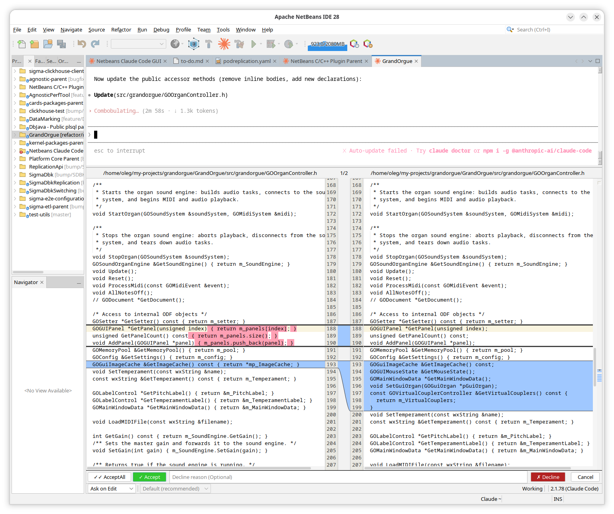

### Permission bar

```
[✓✓ Accept All]  [✓ Accept]   [_Decline reason (Optional)_]  [✗ Decline]   [Cancel]
```

| Button | Effect |
|--------|--------|
| **✓✓ Accept All** | Accept this change **and** switch Claude's edit mode to "Accept on Edit" for this session — all subsequent edits are accepted automatically without showing a diff |
| **✓ Accept** | Allow this single change; Claude continues |
| **✗ Decline** | Reject this change; optionally send a reason to Claude (type it in the text field first) |
| **Cancel** | Reject this change **and** interrupt Claude's current task |
| Close tab (×) | Treated as Decline without a reason |

### When to use each action

| Situation | Action |
|-----------|--------|
| You **agree** with all the proposed changes | Click **✓ Accept** (or **✓✓ Accept All** to skip diffs for all further edits in this session) |
| You **disagree completely** — the change should not be made at all | Click **✗ Decline** (optionally explain why in the reason field) |
| You **partially agree** — the change is on the right track but needs adjustment | Type what needs to be different in the reason field, then press **Enter** or click **✗ Decline**. Claude will receive your feedback and try again. |

### Decline reason
Type a reason in the text field between the Accept and Decline buttons. When you click Decline, the reason is sent to Claude. Pressing Enter in a non-empty reason field automatically clicks Decline.

If you type a decline reason but click Accept, a confirmation dialog warns you that the reason will not be sent.

### Keyboard navigation
Tab / Shift+Tab cycles focus between: Accept All → Accept → reason field → Decline → Cancel.
Press Escape to click Cancel.

### Markdown preview

For `.md` files, a rendered markdown preview is shown alongside the raw diff. Toggle it via **right-click on the diff → Preview Markdown** (checkbox). The default state is configured in **Tools → Options → Claude Code → General → Show markdown preview for .md files in diff**. Toggling in the context menu does not change the global setting.

**Pin Preview** — opens the rendered markdown (proposed content) in a separate IDE tab that remains open after the diff is closed.

Both features are especially useful in Claude's plan mode: they let you read the formatted plan before deciding whether to accept it.

If the file being edited is outside the current project directory, a warning ⚠ is shown in the diff panel.

---

## 11. Settings

Open **Tools → Options → Claude Code** in NetBeans.

### General tab

| Setting | Default | Description |
|---------|---------|-------------|
| Claude CLI path | (empty) | Absolute path to the `claude` executable. Leave empty to use the system `PATH`. |
| MCP server port | 28991 | Port for the internal MCP SSE server. Change only if 28991 conflicts. Requires IDE restart. |
| History max depth | 200 | Maximum number of history entries kept per working directory. |
| History TTL (days) | 0 | Number of days after which history entries expire. 0 = keep forever. |
| Send prompt key | Ctrl+Enter | Key combination that sends the prompt from the input area. |
| Insert newline key | Enter | Key combination that inserts a newline in the input area. The send and newline keys are configured independently but cannot be set to the same value. |
| Debug mode | Off | Enables verbose logging of all Claude I/O to the NetBeans log file and the Output window. |
| Open diff in a separate tab | Off | Opens the diff panel in a new IDE tab instead of embedding it in the session tab. |
| Show markdown preview for .md files in diff | On | Shows a rendered markdown preview alongside the raw diff for `.md` files. |
| Start new session when opening with Claude | Off (Continue last) | Checked → always start a **New session** when opening with the project context menu or when NetBeans restores a closed session tab on restart. Unchecked → **Continue last**. |
| Session list limit | 30 | Maximum number of past sessions shown in the session selector table. |

### Favorites tab

Manages global favorites — prompts available in every project.

The table shows all global favorites with columns: ☐ (checkbox for multi-select), **Text**, **Shortcut**.

**Buttons:**

| Button | Effect |
|--------|--------|
| **Add** | Add a new global favorite (enter text in the dialog) |
| **Edit** | Edit the text of the selected favorite |
| **Assign Shortcut** | Assign a keyboard shortcut to the selected favorite |
| **↑ / ↓** | Change the display order |
| **Delete** | Delete selected favorite(s) |

The search field filters entries by text.

---

## 12. Profiles

Profiles allow you to run Claude Code under different accounts for different projects. Each profile has an isolated `CLAUDE_CONFIG_DIR` so that authentication and settings do not interfere with each other.

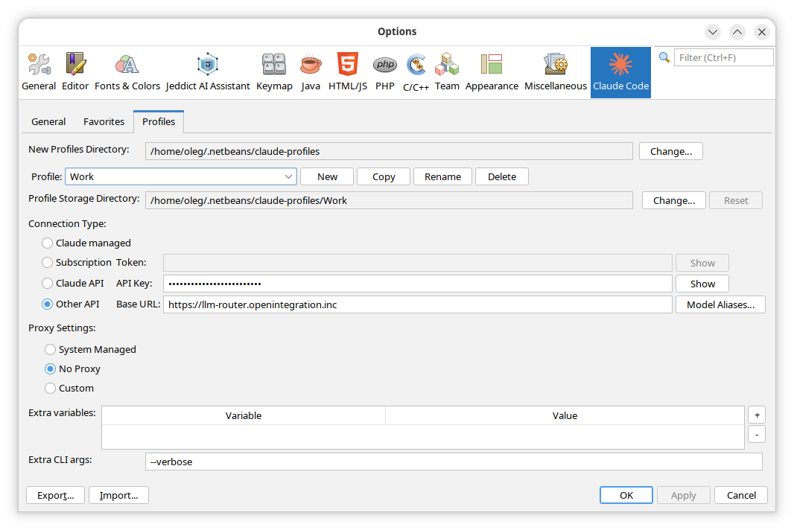

Open **Tools → Options → Claude Code → Profiles**.

The **Default** profile is always present and cannot be renamed or deleted. Named profiles can be freely created, copied, renamed, and deleted.

### Profiles directory

Named profiles are stored under a common base directory (default: `~/.netbeans/claude-plugin/profiles/`). Each profile occupies a subdirectory named after the profile.

The base directory only affects newly created profiles. To move existing profiles to a new location, manually move their subdirectories to the new location first, then update the directory via the **New Profiles Directory** field (click **Change…**).

The read-only **Profile Storage Directory** field shows the storage path for the selected profile. For the Default profile it shows `~/.claude (not overridden)`.

### Managing profiles

| Button | Effect |
|--------|--------|
| **New** | Create a new named profile |
| **Copy** | Duplicate the currently selected profile |
| **Rename** | Rename the currently selected profile |
| **Delete** | Delete the currently selected profile |
| **Change…** | Change the profile storage directory |

### Authentication

Select the authentication type using the radio buttons:

| Type | Fields to fill in | How to authenticate |
|------|------------------|-------------------|
| **Claude Managed** | None | Claude manages authentication itself. Run `claude` in a terminal once to set it up, or Claude will prompt you on first launch. Use `/login` in the session terminal to re-authenticate. |
| **Subscription** | OAuth token | Obtain the token at [claude.ai](https://claude.ai) (requires Pro, Max, Team, or Enterprise subscription). **Note:** OAuth tokens expire periodically and must be regenerated and re-entered manually. For a smoother experience, prefer **Claude Managed** instead. |
| **Claude API** | API key | Obtain the key at [console.anthropic.com](https://console.anthropic.com) (requires an Anthropic Console account with API access). |
| **Other API** | API key + Base URL | Use the API key and base URL provided by your third-party provider. |

### Model aliases (Other API only)

If your provider names models differently from Anthropic's standard names, the plugin cannot match them to the `sonnet`, `opus`, and `haiku` aliases used by Claude Code. In that case, set the alias to the actual model ID used by your provider (for example, with an `anthropic/` prefix).

Click **Model Aliases…** to open the Model Aliases dialog.

The dialog shows a table with three columns:

| Column | Description |
|--------|-------------|
| **ID** | The model identifier as returned by the provider |
| **Available** | ✓ if the model was found at the endpoint during the last Fetch; ✗ otherwise |
| **Alias** | The standard alias to map this model to: `sonnet`, `opus`, `haiku`, `custom`, or blank (no alias) |

**Buttons:**

| Button | Effect |
|--------|--------|
| **Fetch** | Queries the provider's models endpoint using the configured API key, fills the table with discovered model IDs, and marks each as available (✓) or unavailable (✗) |
| **↑ / ↓** | Reorder rows — the order determines how models appear in the status bar model selector |
| **Delete** | Remove the selected row |
| **Prune** | Remove all rows marked as unavailable (✗) |

**How to configure aliases:**

1. Click **Fetch** to populate the table with models available at your endpoint.
2. For each model you want to use as a standard model (`sonnet`, `opus`, or `haiku`), set the corresponding alias. You can skip this step if the model ID already starts with `sonnet`, `opus`, or `haiku` — those are matched automatically.
3. For each additional model you want to appear in the model selector, set its alias to `custom`. You can assign `custom` to as many models as you like — each will appear as a separate entry in the selector.
4. Leave models you do not plan to use with a blank alias, or remove them with **Delete** / **Prune**.

**The `custom` alias:** Unlike the other aliases, `custom` is not unique — multiple models can share it. All models with the `custom` alias appear as individual entries in the **model selector** in the status bar, identified by their full provider ID. Selecting one sends `/model <id>` to Claude.

> **Note:** Not all third-party models are compatible with Claude Code. Using an incompatible model may cause errors or unexpected behavior during the session.

### Proxy settings

| Mode | Description |
|------|-------------|
| **System managed** (default) | Claude Code inherits proxy settings from the IDE environment. Use this when a proxy is already configured in the system. |
| **No proxy** | Forces Claude Code to connect directly, bypassing any system proxy. |
| **Custom** | Specify proxy settings manually. Use this when Claude Code needs a proxy different from the system default. |

**Custom proxy fields:**

| Field | Syntax | Example |
|-------|--------|---------|
| **HTTP Proxy** | `http://host:port` | `http://proxy.example.com:8080` |
| **HTTPS Proxy** | `http://host:port` | `http://proxy.example.com:8080` |
| **NO_PROXY** | Empty or a comma-separated list of host patterns | `localhost,127.0.0.1,.example.com` |

**Note:** Claude Code communicates with the plugin via `localhost`. External proxies are not aware of this. If you fill in the **NO_PROXY** field, make sure it includes `localhost` — otherwise the plugin integration will stop working. If you leave the field empty, the plugin adds `localhost` automatically.

### Extra environment variables

Arbitrary `KEY=VALUE` pairs injected into the Claude process environment. Applied last — they override all other profile variables. Use this for provider-specific configuration.

See the [Claude Code environment variables reference](https://code.claude.com/docs/en/env-vars) for the full list of supported variables, and [third-party integrations](https://code.claude.com/docs/en/third-party-integrations) for compatible API providers (Amazon Bedrock, Google Vertex AI, Microsoft Foundry, and others).

### Extra CLI arguments

An optional space-separated list of command-line flags and values appended to the `claude` command when starting a session. Use this for flags that are not exposed elsewhere in the plugin settings.

Example:
```
--debug --max-turns 5
```

Arguments that contain spaces can be wrapped in double quotes:
```
--system "You are a concise assistant"
```

Arguments are appended after all internally generated arguments. Refer to `claude --help` for the full list of supported flags.

### Per-project profile assignment

By default, Claude Code sessions use the **Default** profile.

#### Persistent profile for a project (recommended)

To permanently assign a profile to a project:
1. Right-click the project in the **Projects** window → **Properties**.
2. Go to the **Claude Code** category.
3. Select the desired profile from the **Profile** drop-down and click **OK**.

The selected profile is used automatically when a session is started for that project via **Open with Claude Code**. Selecting **Default** removes any project-specific assignment.

If the assigned profile no longer exists, the plugin falls back to the Default profile automatically.

#### Temporary profile for one session

Click the **Claude Code** button in the toolbar to open the session selector. Choose a project or a working directory, select a profile from the **Profile** combo, and click **Open**. The selected profile is used for that session only and does not affect project settings. See [Managing Sessions](#13-managing-sessions) for full details of the session selector panel.

---

## 13. Managing Sessions

Sessions let you save your current conversation with Claude, switch to a different task, and come back to the saved session later. For example: you are working on a refactor with Claude, need to quickly fix an unrelated bug, then want to return to the refactor — sessions make this seamless.

### Session modes

Claude Code remembers your past conversations as **sessions**. The **session mode** determines which conversation is loaded — a new empty one, the most recent saved one, or a specific one you choose from a list.

| Mode | When to use |
|------|-------------|
| **New session** | Start a fresh conversation |
| **Continue last** | Resume the most recent session for this working directory |
| **Resume specific** | Return to a specific past session chosen from a list |

**Project context menu** (right-click → Open with Claude Code) — the mode is fixed by the **Start new session when opening with Claude** setting: checked = New session, unchecked = Continue last. Resume specific is not available from the context menu.

**Toolbar button** — you pick the mode explicitly in the session selector panel before opening.

### Session selector panel

The session selector panel is shown in a session tab opened via the **Claude Code toolbar button**. It is not shown when opening via the project context menu (the session starts immediately in that case).

Fields:

- **Project** — combo listing open NetBeans projects; selecting one fills the path automatically.
- **Path** — editable combo with recently used paths + **Browse** button to pick a directory.
- **Profile** — selects which API key/proxy profile to use (see [Profiles](#12-profiles)).
- **Extra args** — additional CLI flags for this session only. Pre-filled from the selected profile's extra CLI arguments; editable here without affecting the profile.
- **Mode** — radio buttons: New session / Continue last / Resume specific.
- **Session table** (visible only when "Resume specific" is selected) — lists past sessions for the chosen working directory, columns: **Date/Time**, **Name**, **First Prompt**. Click a row to select it, then click **Open**. Use the **Rename** button to give a session a custom title. The list is loaded when you switch to "Resume specific" mode and reloads automatically when you change the working directory or profile. The number of sessions shown is limited by the **Session list limit** setting (default: 30); increasing the limit may slow down loading.

Click **Open** to apply the settings and open the session. When "Resume specific" is selected, you can also double-click a row in the session table to open that session immediately.

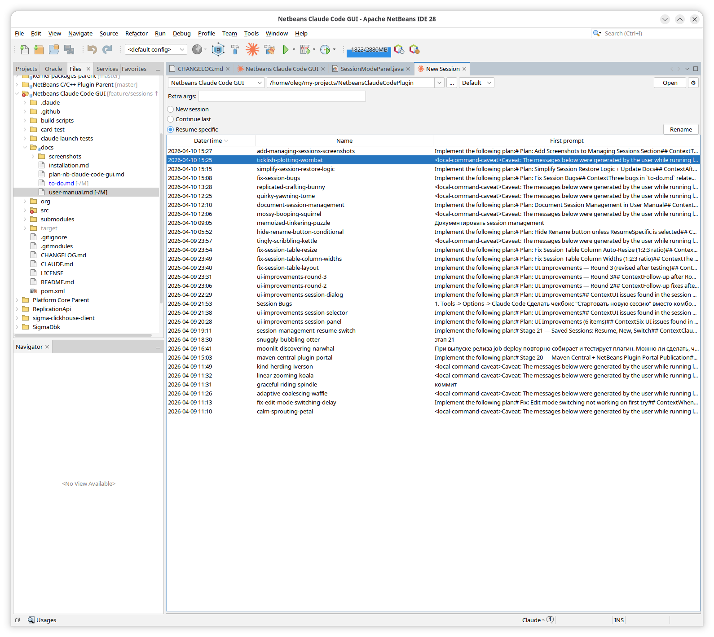

### Closing and switching sessions

While a session is running, you can close it and, optionally, open a different one.

**Closing the tab (× on the tab header)** — closes the session immediately without any confirmation. The conversation is automatically saved by Claude Code and can be resumed later using "Resume specific" mode.

**Close button (⏻) in the status bar** → opens the **Save & Switch** dialog:

- **Session name field** — pre-filled with the current session name. Giving a session a descriptive name makes it easier to find it later in the session list when using "Resume specific".
- **Mode panel** — choose what happens next:
  - **Close only** — stop the session and close the tab. The conversation is saved and can be resumed later.
  - **Restart Advanced...** — stop the session and return to the session selector panel in the same tab, allowing full reconfiguration (directory, profile, mode) before starting a new session.
  - **New session** / **Continue last** / **Resume specific** — stop and immediately start another session in the same tab. For Resume specific, a session table is shown — see [Session selector panel](#session-selector-panel) for details.
- Click **OK** to close (and optionally rename) the session and open the next one as chosen. When "Resume specific" is selected, you can also double-click a row in the session table to confirm immediately.

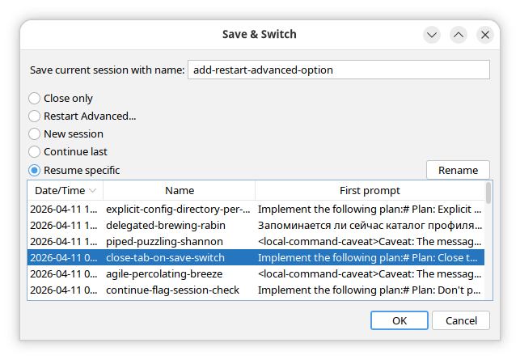

**Context menu in the input area** (right-click, available only during an active session) provides two quick actions:

- **Start New Session** — immediately closes the current session and opens a fresh one (no rename, no dialog).
- **Switch to Session…** — opens Save & Switch pre-selecting "Resume specific".

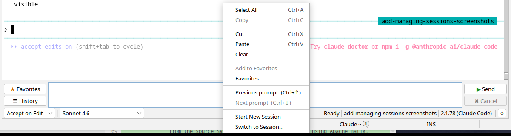

> **Note on `/clear`:** The `/clear` command clears Claude's context within the current session — after that, the previous conversation context is permanently gone and cannot be resumed. To pause your current work and switch to another task temporarily, use **Save & Switch → New session** instead. The original session will remain intact and can be resumed later.

**When to use what:**

| Situation | How |
|-----------|-----|
| Save current session and start a fresh one (can return later) | **Via ⏻:** optionally fill in a session name → New session → OK<br>**Via context menu:** right-click input area → Start New Session (no rename option) |
| Start fresh without being able to return to current context | Type `/clear` in the input area and send it |
| Switch to a specific past session | ⏻ → Resume specific → pick session → OK (or double-click the row)<br>or: right-click input area → Switch to Session… → pick session |
| Close tab, keep session for later | × on the tab<br>or: ⏻ → Close only → OK<br>or: ⏻ → fill in a session name → Close only → OK |
| Stop session, reconfigure everything, then start | ⏻ → Restart Advanced... → OK — returns to the selector panel in the same tab |

### Renaming a session

Sessions can be renamed in three places:

1. **Session selector table** — select a row and click **Rename**.
2. **Save & Switch dialog → session table** (when "Resume specific" is selected) — select a row and click **Rename**.
3. **Save & Switch dialog → Session name field** — renames the currently running session when you close it.

A custom name replaces the auto-generated name in all session lists.

### Session persistence across IDE restarts

When you restart the IDE, the plugin automatically restores any session tabs that were open and reopens them with the same working directory, profile, and extra args.

The session mode used on restore depends on how the session was last opened:
- If the session was opened with **Resume specific** — the same specific session is resumed again (the saved session ID is restored).
- Otherwise (**New session** or **Continue last**) — the mode is determined by the **Start new session when opening with Claude** setting at the time of restart.

---

## 14. IDE Tools (MCP)

The plugin exposes a set of IDE tools to Claude via an MCP (Model Context Protocol) server that runs in the background. These tools give Claude real-time access to your IDE state — open projects, open files, current selection, diagnostics — so it can give more relevant answers and take actions directly in the editor.

### Available tools

| Tool | What it does |
|------|-------------|
| `getWorkspaceFolders` | Lists all open projects with their paths |
| `getOpenEditors` | Lists all currently open editor tabs |
| `getCurrentSelection` | Returns the selected text and cursor position in the active editor |
| `getDiagnostics` | Returns errors and warnings for specified files |
| `openFile` | Opens a file in the editor |
| `close_tab` | Closes an open editor tab |
| `checkDocumentDirty` | Checks whether a file has unsaved changes |
| `saveDocument` | Saves a file to disk |
| `openDiff` | Shows a git diff for a file in the diff viewer |
| `closeAllDiffTabs` | Closes all open diff viewer tabs |
| `permission_prompt` | Shows proposed file changes in the diff panel and waits for your approval |

### Prompts that work well with IDE tools

**Project and file context:**
- "What projects are currently open?"
- "List all files I have open right now."
- "Open the test file for this class."

**Current selection** (select code first, then send the prompt):
- "Explain this code."
- "Write a unit test for this method."
- "What does this do and how can it be improved?"

**Diagnostics:**
- "Fix all errors in this project."
- "What warnings are in `src/main/java/com/example/Foo.java`?"
- "There are compile errors in the open files — fix them."

### Selection change notifications

As you move the cursor or change the selection in any open editor, the plugin automatically notifies Claude of the current file and position. Claude always knows what you are looking at without you needing to mention it in the prompt.

### Troubleshooting MCP tools

If Claude says a tool is unavailable (e.g. "I don't have access to `getWorkspaceFolders`"):

1. Check that no other application is using the MCP server port (**Tools → Options → Claude Code → General → MCP server port**, default: 28991). Change the port if needed and restart the IDE.
2. Enable **Debug mode** and check the log file (`~/.netbeans/<version>/var/log/messages.log`) for `MCP SSE server started on port`.

---

## 15. Troubleshooting

### Enable debug mode
Go to **Tools → Options → Claude Code → General** and check **Debug mode**. This writes detailed logs of all Claude I/O (PTY bytes, MCP messages, hook calls) to the NetBeans log file.

### Log file location
```
~/.netbeans/<version>/var/log/messages.log
```
For example: `~/.netbeans/28/var/log/messages.log`

### Common issues

| Symptom | Likely cause | Fix |
|---------|-------------|-----|
| Session tab does not open | `claude` not found on PATH | Set the full path in **Tools → Options → Claude Code → General → Claude CLI path** |
| Diff panel shows but Accept/Decline have no effect | Claude timed out waiting for the hook response (600 s limit) | Respond to the diff panel within ~9 minutes; if this happens regularly, check for blocking processes |
| Claude asked a question but the Choice Menu panel did not appear | The plugin did not recognise the prompt format | Switch to the terminal area and answer directly by typing |
| Choice Menu appeared but Claude did not ask anything (false trigger) | The plugin mis-detected a numbered list as a menu | Dismiss the panel with **Esc** or ignore it; Claude will continue on its own |
| OAuth login prompt not appearing | The `claude` process cannot open a browser, or proxy settings mismatch | Run `claude` manually in a terminal once to complete authentication, then restart the session. If you use a proxy, make sure the proxy settings in the plugin profile match the system/browser proxy settings. |
| Profile not applied to a project | Project properties not saved | Re-open the project properties, select the profile, and click OK. Alternatively, open the session via the toolbar and select the profile explicitly in the session selector. |
| Favorites shortcut not working | Shortcut conflicts with another IDE action | Re-assign the shortcut in **Tools → Keymap** (search "Claude Favorite") |

### Reporting bugs
Please open an issue at the project's GitHub repository and attach the relevant section of `messages.log` with debug mode enabled.
